# ADR-0014 — Establish Decision Intelligence Architecture Baseline

## Status

Accepted

---

## Purpose

Define the minimum architectural policy required to evolve AXI from a
governed runtime foundation into a governed Decision Intelligence
Platform.

This ADR establishes the Decision as the platform's primary governed
object and publishes the canonical lifecycle, object topology, engine
layering, knowledge separation, and Organizational Digital Twin policy
required for future implementation.

---

## Repository Evidence

The repository already publishes the following evidence:

- `.ai/context/ARCHITECTURE_CONTEXT.md` defines AXI as a governed
  decision platform.
- `README.md` and `Governance/RuntimeRoadmap.md` record that the runtime
  foundation is implemented through `M18 Runtime API`.
- `Governance/ADR/ADR-0010_Engine_Registry_Boundary.md`,
  `ADR-0011_Pipeline_Runtime_Boundary.md`,
  `ADR-0012_Runtime_CLI_Surface_Boundary.md`, and
  `ADR-0013_Runtime_API_Surface_Boundary.md` publish the current
  runtime boundaries.
- `Governance/Schemas/AXI-SCH-007_Platform_Object.json` already
  publishes `Decision` as a platform object type.
- `Governance/Schemas/AXI-SCH-006_Decisions.json`,
  `Governance/Decisions/DECISION_REGISTER.md`,
  `Governance/Capabilities/CAPABILITY_REGISTER.md`, and
  `Governance/Roadmap/AXI_Roadmap_v1.0.md` exist only as placeholders
  before this ADR is published.

The repository does not publish, before this ADR:

- a canonical decision lifecycle
- a canonical decision-domain schema
- a canonical decision-domain object topology
- a first-class Organizational Digital Twin domain policy
- a governed decision-intelligence engine layering policy
- a governed knowledge-separation policy for methodology, external
  knowledge, organizational knowledge, learned knowledge, and governed
  expertise

---

## Architectural Policy

Adopt the following Decision Intelligence architecture baseline.

### 1. Primary Governed Object

- The Decision is the primary governed object of the AXI Platform.
- All major platform components shall exist to improve decision quality,
  decision explainability, decision traceability, decision learning, or
  governed execution of approved decisions.
- Future services, engines, applications, pipelines, and interfaces
  shall trace their value back to one or more decision lifecycle stages.

### 2. Canonical Decision Lifecycle

AXI shall use the following canonical lifecycle in this exact order:

1. Observe
2. Discover
3. Situational Assessment
4. Gather Evidence
5. Assess Context
6. Frame Decision
7. Generate Alternatives
8. Analyze Tradeoffs
9. Evaluate Constraints
10. Evaluate Human Factors
11. Evaluate Capacity
12. Evaluate Calendar
13. Evaluate Ethics
14. Recommend
15. Human Approval
16. Execute
17. Monitor
18. Measure
19. Learn
20. Improve Expertise
21. Update Organizational Digital Twin

Future implementation shall preserve traceable continuity across the
entire lifecycle. No future runtime or application surface may skip the
`Human Approval` stage for governed decisions unless a later approved
ADR explicitly defines a narrower exception.

### 3. Canonical Platform Objects

Future decision-domain artifacts shall be modeled through the published
Platform Object boundary and the following canonical object types:

- `Decision`
- `DecisionContext`
- `Mission`
- `Organization`
- `Person`
- `Role`
- `Evidence`
- `Knowledge`
- `Expertise`
- `Capability`
- `Constraint`
- `Risk`
- `Opportunity`
- `Alternative`
- `Recommendation`
- `Execution`
- `Outcome`
- `Observation`
- `Lesson`
- `Metric`
- `Objective`
- `Policy`
- `Timeline`
- `Resource`
- `Dependency`
- `Assumption`

These objects define the minimum decision-domain topology for future
governed implementation.

### 4. Organizational Digital Twin

The Organizational Digital Twin is a first-class architectural domain.

It shall not be treated as a supporting feature or derived convenience.

The Organizational Digital Twin domain is the governed representation of
the organization's:

- mission
- objectives
- people
- roles
- capabilities
- resources
- dependencies
- timelines
- policies
- expertise
- knowledge
- measured outcomes

Future implementation may distribute these concerns across multiple
schemas and runtime components, but the architecture shall preserve them
as one coherent governed domain.

Decision outcomes, observations, and lessons shall be capable of
updating this domain through explicit, traceable records.

### 5. Knowledge Architecture Separation

AXI shall maintain strict separation between the following knowledge
domains:

- AXI Methodology
- External Knowledge
- Organizational Knowledge
- Learned Knowledge
- Governed Expertise

Future implementation shall not merge these domains into one
undifferentiated store.

If information is transformed from one knowledge domain into another,
the transformation shall preserve provenance, source references, and the
decision or learning event that justified the change.

### 6. Engine Layering

Future decision-intelligence engines shall be organized into the
following layers:

- Intelligence Layer
- Reasoning Layer
- Execution Layer
- Governance Layer

This layering is architectural governance, not implementation guidance
for one specific runtime package.

The approved architectural engine set is:

| Engine | Primary Layer | Unique Responsibility |
| --- | --- | --- |
| Situational Intelligence | Intelligence | Convert observations, metrics, and signals into governed situational assessments and candidate decision triggers. |
| Context | Intelligence | Assemble mission, organization, role, policy, resource, dependency, and timeline context for a decision. |
| Behavioral Intelligence | Intelligence | Model stakeholder behavior, incentives, adoption risk, and other human-factor conditions. |
| Assumption | Reasoning | Make assumptions explicit, attach confidence and uncertainty, and track assumption invalidation. |
| Scenario | Reasoning | Generate distinct alternatives and plausible future scenarios. |
| Forecast | Reasoning | Estimate likely outcome trajectories for alternatives. |
| Simulation | Reasoning | Stress-test alternatives and execution plans against Organizational Digital Twin state. |
| Optimization | Reasoning | Rank alternatives against objectives, constraints, and tradeoffs without replacing human accountability. |
| Collaboration | Execution | Coordinate human approval, assignments, execution handoffs, and feedback collection. |
| Constraint | Governance | Apply policy, resource, dependency, calendar, and ethics limits as binding governance checks. |
| Explanation | Governance | Produce rationale, traceability, and explanation artifacts for recommendations and outcomes. |
| Trust | Governance | Evaluate provenance completeness, integrity, confidence, uncertainty, and decision trustworthiness. |
| Expertise Lifecycle | Governance | Convert outcomes and lessons into governed expertise improvements and Organizational Digital Twin updates. |

No additional engine domain is approved by this ADR.

Future governance may publish additional engines only when the new
engine has a unique responsibility that cannot be composed safely from
the approved set above.

### 7. Overlap Control

To prevent uncontrolled engine proliferation:

- `Situational Intelligence` shall not own stable organizational or
  policy context.
- `Context` shall not generate recommendations or replace evidence
  assessment.
- `Assumption` shall not replace binding constraint evaluation.
- `Scenario`, `Forecast`, `Simulation`, and `Optimization` are distinct
  and shall not be collapsed into one undifferentiated analysis engine.
- `Explanation` and `Trust` are separate. Explanation answers why;
  Trust evaluates whether the decision record is credible and complete.
- `Collaboration` shall not replace human accountability with automated
  approval.
- `Expertise Lifecycle` shall not overwrite learned knowledge or the
  Organizational Digital Twin without traceable decision and outcome
  lineage.

### 8. Constitutional Validation Requirements

Every governed recommendation and governed decision record shall support
explicit representation of:

- evidence
- provenance
- explainability
- traceability
- human accountability
- assumptions
- confidence
- uncertainty
- ethics
- alternative analysis
- capacity awareness
- calendar awareness
- human factors
- strategic alignment

Future schemas, contracts, and runtime boundaries shall preserve these
signals rather than reducing them to free-form narrative.

### 9. Runtime Compatibility Boundary

This ADR does not authorize:

- new runtime code
- a Decision Service implementation
- a Decision Engine implementation
- a new API, CLI, or GUI surface
- autonomous decision approval
- replacement of the published runtime foundations through `M18`

Publication of this ADR establishes architectural governance only.

---

## Architectural View

```mermaid
flowchart LR
    O["Observe / Discover"] --> S["Situational Assessment"]
    S --> E["Gather Evidence"]
    E --> C["Assess Context"]
    C --> F["Frame Decision"]
    F --> A["Generate Alternatives"]
    A --> T["Analyze Tradeoffs"]
    T --> V["Evaluate Constraints / Human Factors / Capacity / Calendar / Ethics"]
    V --> R["Recommend"]
    R --> H["Human Approval"]
    H --> X["Execute"]
    X --> M["Monitor / Measure"]
    M --> L["Learn"]
    L --> G["Improve Expertise"]
    G --> D["Update Organizational Digital Twin"]

    GOV["Governance Layer\nTrust / Explanation / Constraint / Expertise Lifecycle"] -. applies across .- O
    GOV -. applies across .- D
```

---

## Future Guidance

Future governance should proceed in the following order:

1. Publish the decision-domain schema and registers required by this ADR.
2. Publish Organizational Digital Twin and knowledge-domain governance.
3. Publish engine-specific ADRs and contracts only for engine domains
   that are ready for implementation.
4. Publish runtime or application work items only after the upstream
   decision-domain governance exists.

---

## Non-Goals

This ADR does not approve:

- a new registry inheritance model
- a new runtime orchestration layer
- a combined knowledge store
- a standalone Digital Twin engine
- removal or replacement of existing ADRs
- any post-`M18` runtime implementation claim

---

## Related

- `.ai/context/ARCHITECTURE_CONTEXT.md`
- `Governance/ADR/ADR-0010_Engine_Registry_Boundary.md`
- `Governance/ADR/ADR-0011_Pipeline_Runtime_Boundary.md`
- `Governance/ADR/ADR-0012_Runtime_CLI_Surface_Boundary.md`
- `Governance/ADR/ADR-0013_Runtime_API_Surface_Boundary.md`
- `Governance/Schemas/AXI-SCH-006_Decisions.json`
- `Governance/Schemas/AXI-SCH-007_Platform_Object.json`
- `Governance/Decisions/DECISION_REGISTER.md`
- `Governance/Capabilities/CAPABILITY_REGISTER.md`
- `Governance/Roadmap/AXI_Roadmap_v1.0.md`
