# DGM-001 — Decision Intelligence Baseline Map

**Diagram ID:** `DGM-001`
**Version:** `1.0.0`
**Status:** `Approved`
**Lifecycle State:** `Active`
**Owner:** `AXI Platform Governance`
**Review Cycle:** `Annual and change-triggered`
**Approval Authority:** `AXI Platform Governance`
**Source Publication:** `ADR-0014`
**Notation:** `Mermaid`
**Categories:** `Decision Lifecycle`, `Capability Maps`, `Engine Layering`
**Related ADRs:** `ADR-0014`, `ADR-0017`
**Related Schemas:** `AXI-SCH-006`, `AXI-SCH-007`, `AXI-SCH-008`, `AXI-SCH-023`
**Related Capabilities:** `CAP-001` through `CAP-010`, `CAP-018`

---

# Purpose

Provide the canonical visual baseline for AXI's decision-centric
architecture.

This diagram visualizes the lifecycle, layer boundaries, and supporting
governance surfaces approved by `ADR-0014`.

---

# Diagram

```mermaid
flowchart LR
    subgraph IL["Intelligence Layer"]
        O["Observe"] --> D["Discover"]
        D --> SA["Situational Assessment"]
        SA --> GE["Gather Evidence"]
        GE --> AC["Assess Context"]
    end

    subgraph RL["Reasoning Layer"]
        AC --> FD["Frame Decision"]
        FD --> GA["Generate Alternatives"]
        GA --> AT["Analyze Tradeoffs"]
        AT --> EC["Evaluate Constraints"]
        EC --> HF["Evaluate Human Factors"]
        HF --> ECE["Evaluate Capacity Calendar Ethics"]
        ECE --> R["Recommend"]
    end

    subgraph EL["Execution Layer"]
        R --> HA["Human Approval"]
        HA --> EX["Execute"]
        EX --> MM["Monitor and Measure"]
    end

    subgraph GL["Governance Layer"]
        MM --> L["Learn and Improve Expertise"]
        L --> ODT["Update Organizational Digital Twin"]
    end

    EV["Evidence and Provenance"] --> GE
    CTX["Mission Organization Role Policy Resource Timeline"] --> AC
    ALT["Alternatives Risk Opportunity Assumption"] --> GA
    EXP["Explainability Traceability Human Accountability"] --> R
```

---

# Synchronization Requirements

- Review when the canonical decision lifecycle changes.
- Review when layer responsibilities or capability mappings change.
- Review when `AXI-SCH-006`, `AXI-SCH-007`, or `AXI-SCH-008` changes a
  visualized structure.

---

# Revision History

| Version | Date | Summary | Authority |
| --- | --- | --- | --- |
| `1.0.0` | `2026-07-19` | Initial governed publication. | AXI Platform Governance |

---

# Review History

| Date | Reviewer | Outcome | Notes |
| --- | --- | --- | --- |
| `2026-07-19` | AXI Platform Governance | Approved | Published as the canonical diagram for the decision architecture baseline. |
