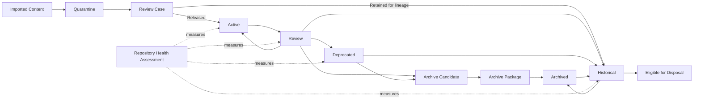

# DGM-002 — Repository Stewardship Lifecycle Map

**Diagram ID:** `DGM-002`
**Version:** `1.0.0`
**Status:** `Approved`
**Lifecycle State:** `Active`
**Owner:** `AXI Platform Governance`
**Review Cycle:** `Annual and change-triggered`
**Approval Authority:** `AXI Platform Governance`
**Source Publication:** `ADR-0015`
**Notation:** `Mermaid`
**Categories:** `Repository Lifecycle`, `Information Lifecycle`, `Archive Lifecycle`, `Review and Quarantine Workflow`
**Related ADRs:** `ADR-0015`, `ADR-0017`
**Related Schemas:** `AXI-SCH-015`, `AXI-SCH-016`, `AXI-SCH-017`, `AXI-SCH-018`, `AXI-SCH-023`
**Related Capabilities:** `CAP-011`, `CAP-012`, `CAP-013`, `CAP-014`, `CAP-018`

---

# Purpose

Provide the canonical visual baseline for repository stewardship,
information lifecycle, archival, and imported-content review.

---

# Diagram

---

# Synchronization Requirements

- Review when lifecycle states or allowed transitions change.
- Review when archival structure or restoration obligations change.
- Review when review-case or repository-health governance changes a
  visualized relationship.

---

# Revision History

| Version | Date | Summary | Authority |
| --- | --- | --- | --- |
| `1.0.0` | `2026-07-19` | Initial governed publication. | AXI Platform Governance |

---

# Review History

| Date | Reviewer | Outcome | Notes |
| --- | --- | --- | --- |
| `2026-07-19` | AXI Platform Governance | Approved | Published as the canonical diagram for repository stewardship governance. |
