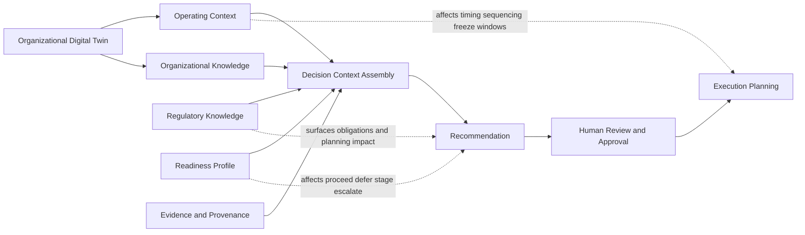

# DGM-003 — Decision Support Context Integration Map

**Diagram ID:** `DGM-003`
**Version:** `1.0.0`
**Status:** `Approved`
**Lifecycle State:** `Active`
**Owner:** `AXI Platform Governance`
**Review Cycle:** `Annual and change-triggered`
**Approval Authority:** `AXI Platform Governance`
**Source Publication:** `ADR-0016`
**Notation:** `Mermaid`
**Categories:** `Organizational Operating Context`, `Readiness Framework`, `Knowledge Architecture`
**Related ADRs:** `ADR-0016`, `ADR-0017`
**Related Schemas:** `AXI-SCH-019`, `AXI-SCH-020`, `AXI-SCH-021`, `AXI-SCH-023`
**Related Capabilities:** `CAP-003`, `CAP-004`, `CAP-015`, `CAP-016`, `CAP-017`, `CAP-018`

---

# Purpose

Provide the canonical visual baseline for how operating context,
regulatory knowledge, and readiness affect decision recommendations
before execution planning.

---

# Diagram

---

# Synchronization Requirements

- Review when operating-context domains change.
- Review when regulatory-knowledge boundary or readiness effects
  change.
- Review when recommendation or execution-planning integration changes.

---

# Revision History

| Version | Date | Summary | Authority |
| --- | --- | --- | --- |
| `1.0.0` | `2026-07-19` | Initial governed publication. | AXI Platform Governance |

---

# Review History

| Date | Reviewer | Outcome | Notes |
| --- | --- | --- | --- |
| `2026-07-19` | AXI Platform Governance | Approved | Published as the canonical diagram for operating context, regulatory knowledge, and readiness governance. |
