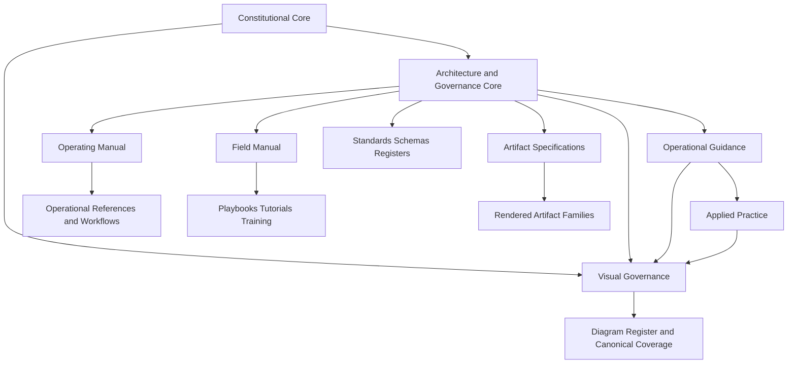

# DGM-004 — Publication Governance Topology

**Diagram ID:** `DGM-004`
**Version:** `1.1.0`
**Status:** `Approved`
**Lifecycle State:** `Active`
**Owner:** `AXI Platform Governance`
**Review Cycle:** `Annual and change-triggered`
**Approval Authority:** `AXI Platform Governance`
**Source Publication:** `ADR-0017`
**Notation:** `Mermaid`
**Categories:** `Platform Architecture`, `Object Relationships`, `Dependency Graphs`
**Related ADRs:** `ADR-0017`, `ADR-0018`
**Related Schemas:** `AXI-SCH-022`, `AXI-SCH-023`, `AXI-SCH-027`
**Related Capabilities:** `CAP-018`, `CAP-022`

---

# Purpose

Provide the canonical visual baseline for AXI's publication hierarchy
and the governed relationship between textual publications and diagrams.

---

# Diagram

---

# Synchronization Requirements

- Review when the publication hierarchy changes.
- Review when approval authority or cross-reference rules change.
- Review when new publication families or publication types are
  approved.

---

# Revision History

| Version | Date | Summary | Authority |
| --- | --- | --- | --- |
| `1.0.0` | `2026-07-19` | Initial governed publication. | AXI Platform Governance |
| `1.1.0` | `2026-07-19` | Added Artifact Specifications to the governed publication topology. | AXI Platform Governance |

---

# Review History

| Date | Reviewer | Outcome | Notes |
| --- | --- | --- | --- |
| `2026-07-19` | AXI Platform Governance | Approved | Published as the canonical diagram for publication and documentation governance. |
| `2026-07-19` | AXI Platform Governance | Approved | Reviewed and updated to reflect the governed Artifact Specification publication type. |
