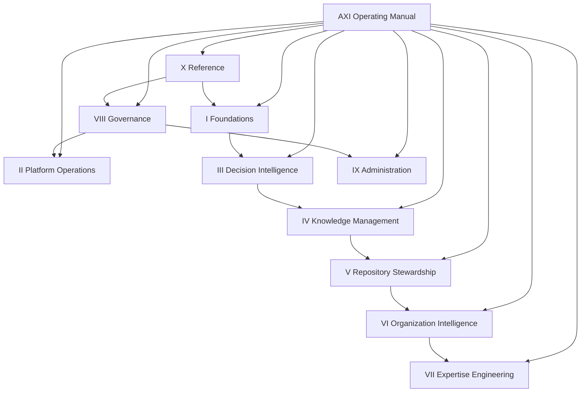

# DGM-005 — Operating Manual Volume Map

**Diagram ID:** `DGM-005`
**Version:** `1.0.0`
**Status:** `Approved`
**Lifecycle State:** `Active`
**Owner:** `AXI Platform Governance`
**Review Cycle:** `Semiannual and change-triggered`
**Approval Authority:** `AXI Platform Governance`
**Source Publication:** `PUB-002`
**Notation:** `Mermaid`
**Categories:** `Workflow Diagrams`, `Dependency Graphs`
**Related ADRs:** `ADR-0017`
**Related Schemas:** `AXI-SCH-022`, `AXI-SCH-023`
**Related Capabilities:** `CAP-018`

---

# Purpose

Provide the canonical visual baseline for the AXI Operating Manual
volume topology.

---

# Diagram

---

# Synchronization Requirements

- Review when volume boundaries or purposes change.
- Review when a new volume is introduced or removed.
- Review when the operating-manual relationship to governing
  publications changes materially.

---

# Revision History

| Version | Date | Summary | Authority |
| --- | --- | --- | --- |
| `1.0.0` | `2026-07-19` | Initial governed publication. | AXI Platform Governance |

---

# Review History

| Date | Reviewer | Outcome | Notes |
| --- | --- | --- | --- |
| `2026-07-19` | AXI Platform Governance | Approved | Published as the canonical diagram for the Operating Manual architecture baseline. |
