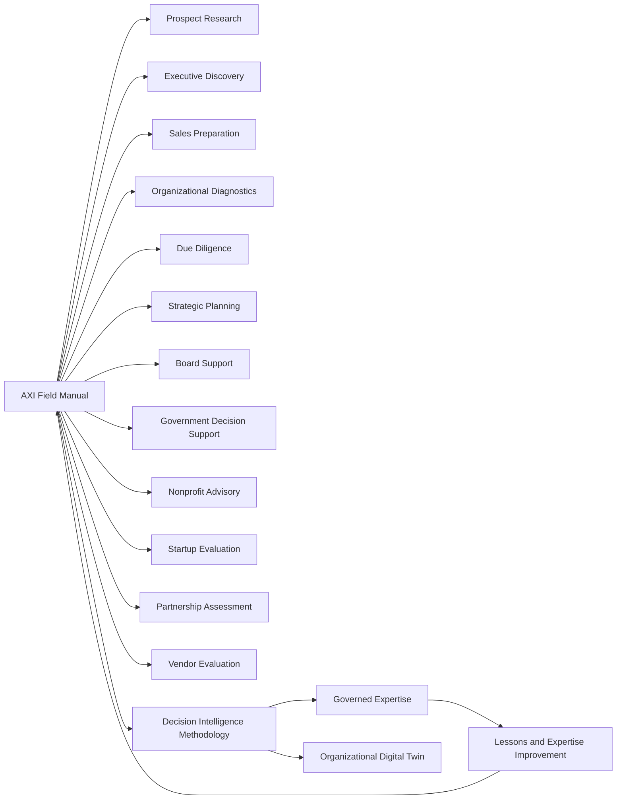

# DGM-006 — Field Manual Integration Map

**Diagram ID:** `DGM-006`
**Version:** `1.0.0`
**Status:** `Approved`
**Lifecycle State:** `Active`
**Owner:** `AXI Platform Governance`
**Review Cycle:** `Semiannual and change-triggered`
**Approval Authority:** `AXI Platform Governance`
**Source Publication:** `PUB-003`
**Notation:** `Mermaid`
**Categories:** `Workflow Diagrams`, `Object Relationships`
**Related ADRs:** `ADR-0014`, `ADR-0016`, `ADR-0017`
**Related Schemas:** `AXI-SCH-006`, `AXI-SCH-021`, `AXI-SCH-022`, `AXI-SCH-023`
**Related Capabilities:** `CAP-001` through `CAP-010`, `CAP-017`, `CAP-018`

---

# Purpose

Provide the canonical visual baseline for how field-manual playbooks
connect to Decision Intelligence and governed expertise.

---

# Diagram

---

# Synchronization Requirements

- Review when the playbook domain set changes.
- Review when field-manual outputs no longer align to the decision
  lifecycle or expertise-update loop.
- Review when readiness or context requirements materially change.

---

# Revision History

| Version | Date | Summary | Authority |
| --- | --- | --- | --- |
| `1.0.0` | `2026-07-19` | Initial governed publication. | AXI Platform Governance |

---

# Review History

| Date | Reviewer | Outcome | Notes |
| --- | --- | --- | --- |
| `2026-07-19` | AXI Platform Governance | Approved | Published as the canonical diagram for the Field Manual architecture baseline. |
