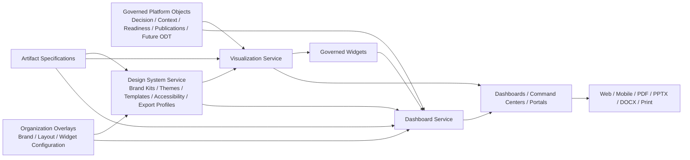

# DGM-007 — Presentation Services Topology

**Diagram ID:** `DGM-007`
**Version:** `1.0.0`
**Status:** `Approved`
**Lifecycle State:** `Active`
**Owner:** `AXI Platform Governance`
**Review Cycle:** `Annual and change-triggered`
**Approval Authority:** `AXI Platform Governance`
**Source Publication:** `ADR-0018`
**Notation:** `Mermaid`
**Categories:** `Presentation Architecture`, `Dashboard Architecture`, `Design System Architecture`, `Visualization Standards`, `Dependency Graphs`
**Related ADRs:** `ADR-0014`, `ADR-0017`, `ADR-0018`
**Related Schemas:** `AXI-SCH-007`, `AXI-SCH-022`, `AXI-SCH-023`, `AXI-SCH-024`, `AXI-SCH-025`, `AXI-SCH-026`, `AXI-SCH-027`, `AXI-SCH-028`
**Related Capabilities:** `CAP-019`, `CAP-020`, `CAP-021`, `CAP-022`

---

# Purpose

Provide the canonical visual baseline for AXI's governed presentation
services and their dependency on governed objects, design-system
controls, artifact specifications, and organization overlays.

---

# Diagram

---

# Synchronization Requirements

- Review when `ADR-0018` changes a service boundary, object boundary,
  or customization rule.
- Review when the dashboard, widget, design-system, artifact-
  specification, or visualization schemas change meaning.
- Review when organization overlay or export-profile governance changes.

---

# Revision History

| Version | Date | Summary | Authority |
| --- | --- | --- | --- |
| `1.0.0` | `2026-07-19` | Initial governed publication. | AXI Platform Governance |

---

# Review History

| Date | Reviewer | Outcome | Notes |
| --- | --- | --- | --- |
| `2026-07-19` | AXI Platform Governance | Approved | Published as the canonical diagram for presentation-services governance. |
