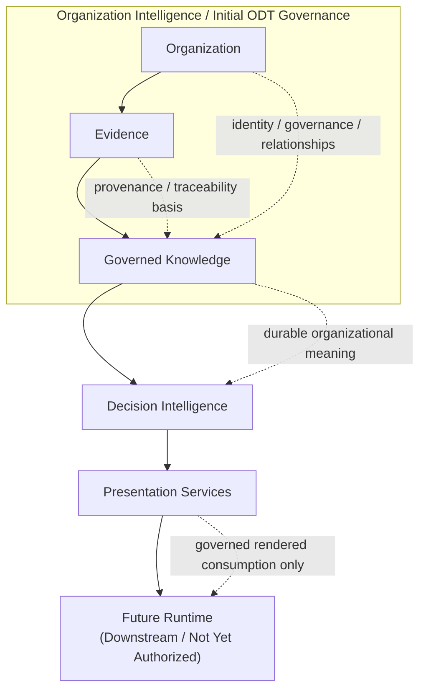

# DGM-008 — Organization Intelligence ODT Foundation Map

**Diagram ID:** `DGM-008`
**Version:** `1.0.0`
**Status:** `Approved`
**Lifecycle State:** `Active`
**Owner:** `AXI Platform Governance`
**Review Cycle:** `Annual and change-triggered`
**Approval Authority:** `AXI Platform Governance`
**Source Publication:** `PUB-011`
**Notation:** `Mermaid`
**Categories:** `Organizational Digital Twin`, `Knowledge Architecture`, `Object Relationships`, `Dependency Graphs`
**Related ADRs:** `ADR-0014`, `ADR-0017`, `ADR-0018`, `ADR-0019`
**Related Schemas:** `AXI-SCH-006`, `AXI-SCH-007`, `AXI-SCH-023`, `AXI-SCH-029`, `AXI-SCH-030`
**Related Capabilities:** `CAP-002`, `CAP-003`, `CAP-010`, `CAP-018`, `CAP-019`, `CAP-021`

---

# Purpose

Provide the first canonical visual baseline for how Organization
Intelligence connects durable organization and knowledge meaning to
decision use, presentation use, and future runtime consumers without
authorizing implementation behavior.

---

# Diagram

---

# Synchronization Requirements

- Review when `PUB-011` changes the constitutional role or domain
  boundary of Organization Intelligence.
- Review when `ADR-0019` changes object-family responsibilities or
  cross-domain reference rules.
- Review when `AXI-SCH-029` or `AXI-SCH-030` changes organization or
  knowledge meaning.
- Review when presentation-governance boundaries change the downstream
  relationship between governed objects and rendered artifacts.

---

# Revision History

| Version | Date | Summary | Authority |
| --- | --- | --- | --- |
| `1.0.0` | `2026-07-19` | Initial governed publication. | AXI Platform Governance |

---

# Review History

| Date | Reviewer | Outcome | Notes |
| --- | --- | --- | --- |
| `2026-07-19` | AXI Platform Governance | Approved | Published as the first canonical diagram for the Organization Intelligence architecture baseline. |
