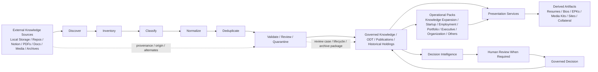

# DGM-009 — Knowledge Expansion And Operationalization Topology

**Diagram ID:** `DGM-009`
**Version:** `1.0.0`
**Status:** `Approved`
**Lifecycle State:** `Active`
**Owner:** `AXI Platform Governance`
**Review Cycle:** `Annual and change-triggered`
**Approval Authority:** `AXI Platform Governance`
**Source Publication:** `ADR-0020`
**Notation:** `Mermaid`
**Categories:** `Knowledge Architecture`, `Workflow Diagrams`, `Dependency Graphs`, `Object Relationships`
**Related ADRs:** `ADR-0014`, `ADR-0015`, `ADR-0017`, `ADR-0018`, `ADR-0019`, `ADR-0020`
**Related Schemas:** `AXI-SCH-006`, `AXI-SCH-007`, `AXI-SCH-015`, `AXI-SCH-018`, `AXI-SCH-019`, `AXI-SCH-020`, `AXI-SCH-021`, `AXI-SCH-023`, `AXI-SCH-029`, `AXI-SCH-030`
**Related Capabilities:** `CAP-001`, `CAP-002`, `CAP-003`, `CAP-011`, `CAP-012`, `CAP-013`, `CAP-014`, `CAP-018`, `CAP-019`, `CAP-021`, `CAP-022`

---

# Purpose

Provide the canonical visual baseline for how external knowledge
sources, repository stewardship controls, Organization Intelligence,
future Operational Packs, and Presentation Services relate within the
Knowledge Expansion and Repository Operationalization architecture.

---

# Diagram

---

# Synchronization Requirements

- Review when `ADR-0020` changes the Knowledge Expansion progression,
  Pack boundary, or operational-workspace policy.
- Review when `ADR-0015` changes imported-content review, archive, or
  lifecycle meaning.
- Review when `ADR-0018` changes the downstream boundary between
  governed knowledge and rendered artifacts.
- Review when future schemas change the meaning of review, provenance,
  Organization Intelligence, or pack-governance structures visualized by
  this diagram.

---

# Revision History

| Version | Date | Summary | Authority |
| --- | --- | --- | --- |
| `1.0.0` | `2026-07-19` | Initial governed publication. | AXI Platform Governance |

---

# Review History

| Date | Reviewer | Outcome | Notes |
| --- | --- | --- | --- |
| `2026-07-19` | AXI Platform Governance | Approved | Published as the canonical diagram for Knowledge Expansion and Repository Operationalization governance. |
