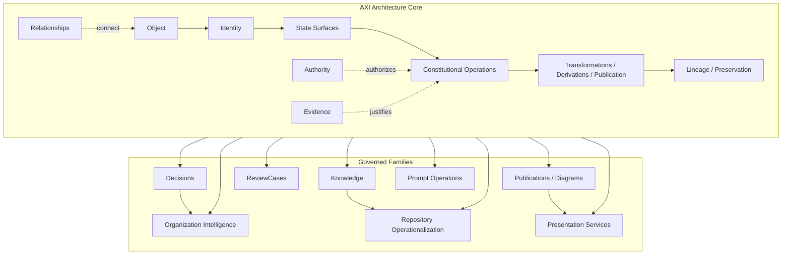

# DGM-010 — Architecture Core Constitutional Topology

**Diagram ID:** `DGM-010`
**Version:** `1.0.0`
**Status:** `Approved`
**Lifecycle State:** `Active`
**Owner:** `AXI Platform Governance`
**Review Cycle:** `Annual and change-triggered`
**Approval Authority:** `AXI Platform Governance`
**Source Publication:** `PUB-019`
**Notation:** `Mermaid`
**Categories:** `Platform Architecture`, `Object Relationships`, `Workflow Diagrams`, `Dependency Graphs`
**Related ADRs:** `ADR-0014`, `ADR-0015`, `ADR-0017`, `ADR-0018`, `ADR-0019`, `ADR-0020`, `ADR-0021`, `ADR-0022`, `ADR-0023`, `ADR-0024`
**Related Schemas:** `AXI-SCH-006`, `AXI-SCH-007`, `AXI-SCH-015`, `AXI-SCH-018`, `AXI-SCH-022`, `AXI-SCH-023`, `AXI-SCH-029`, `AXI-SCH-030`, `AXI-SCH-031`
**Related Capabilities:** `CAP-002`, `CAP-003`, `CAP-011`, `CAP-018`, `CAP-023`

---

# Purpose

Provide the canonical visual baseline for how the Architecture Core
governs identity, state surfaces, authority, evidence, operations,
relationships, lineage, and downstream families without authorizing
implementation.

---

# Diagram

---

# Synchronization Requirements

- Review when `PUB-019` changes the primitive model, layer ordering, or
  family-specialization boundary.
- Review when `ADR-0024` changes the Architecture Core constitutional
  floor.
- Review when a later schema or publication changes how identity,
  state-surface separation, lineage, or downstream inheritance is
  visualized here.
- Review when future governance claims a new major family-specific
  exception to the Architecture Core.

---

# Revision History

| Version | Date | Summary | Authority |
| --- | --- | --- | --- |
| `1.0.0` | `2026-07-19` | Initial governed publication. | AXI Platform Governance |

---

# Review History

| Date | Reviewer | Outcome | Notes |
| --- | --- | --- | --- |
| `2026-07-19` | AXI Platform Governance | Approved | Published as the canonical diagram for the Architecture Core constitutional foundation. |
