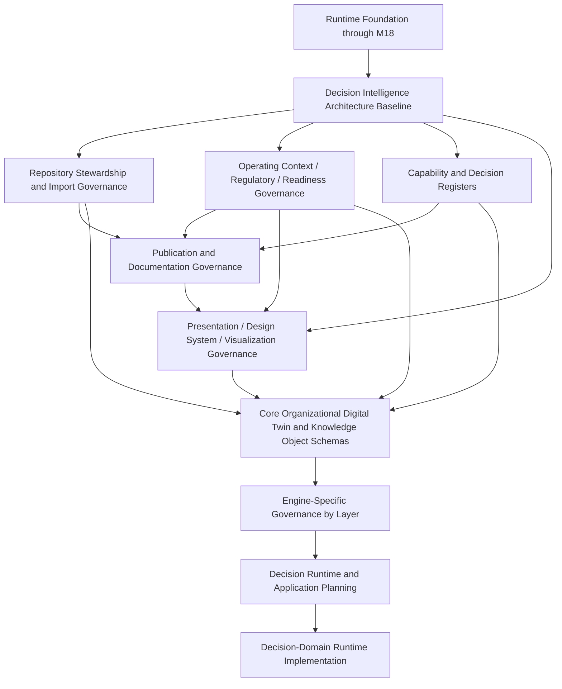

# AXI Decision Intelligence Roadmap

**Version:** 1.6.0
**Status:** Approved
**Authority:** AXI Platform Governance
**Audit Date:** 2026-07-19

---

# Purpose

Publish the post-`M18` architectural sequence that evolves AXI from a
governed runtime foundation into a governed Decision Intelligence
Platform.

This roadmap complements `Governance/RuntimeRoadmap.md`.

`Governance/RuntimeRoadmap.md` remains authoritative for runtime
dependencies through `M18`.

---

# Current State

- The governed runtime foundation is implemented through
  `M18 Runtime API`.
- The runtime foundation provides the reusable execution substrate for
  future decision-intelligence work.
- `ADR-0014` now publishes the decision-centric architecture baseline.
- `AXI-SCH-006`, `DECISION_REGISTER`, and `CAPABILITY_REGISTER` now
  publish the core decision-domain governance baseline.
- `ADR-0015` and `ADR-0016` now publish repository stewardship,
  archival, imported-content review, operating context, regulatory
  knowledge, and readiness governance.
- `AXI-SCH-015` through `AXI-SCH-021` now publish the corresponding
  architectural data structures.
- `ADR-0017`, `AXI-SCH-022`, `AXI-SCH-023`,
  `PUBLICATION_REGISTER`, `DIAGRAM_REGISTER`, the Operating Manual
  architecture, the Field Manual architecture, and documentation
  standards now publish the documentation and diagram governance
  baseline.
- `M21`, `ADR-0018`, `AXI-SCH-024` through `AXI-SCH-028`,
  `PUB-007` through `PUB-010`, and `DGM-007` now publish the
  presentation-services governance baseline for dashboards, widgets,
  design-system assets, artifact specifications, and visualizations.
- `ADR-0019` and `M22` now publish the readiness governance required
  to begin the next Organization Intelligence and core `ODT`
  schema-and-register milestone without authorizing runtime
  implementation.
- `PUB-011` now publishes the constitutional Organization
  Intelligence architecture baseline, and `AXI-SCH-029`,
  `AXI-SCH-030`, `PUB-012`, `PUB-013`, and `DGM-008` now publish the
  first constitutional Organization and Knowledge artifact set within
  `M22`, but the phase remains in progress until the remaining core
  `ODT` object-family schemas and registers are published.
- No decision-domain runtime implementation is claimed by this roadmap.

---

# Roadmap Phases

| Order | Phase | State | Entry Gate | Exit Gate |
| --- | --- | --- | --- | --- |
| 1 | Runtime Foundation through `M18` | Complete | Published runtime governance and dependencies | `Governance/RuntimeRoadmap.md` and `Governance/DependencyMatrix.md` remain consistent with repository evidence |
| 2 | Decision Intelligence Architecture Baseline | Complete | Runtime foundation through `M18` plus published decision-centric ADR | Canonical lifecycle, object topology, capability map, and decision schema are published |
| 3 | Repository Stewardship and Import Governance | Complete | Phase 2 complete | Information lifecycle, repository health, archive, and review/quarantine governance are published |
| 4 | Operating Context, Regulatory Knowledge, and Readiness Governance | Complete | Phase 2 complete | Operating context, regulatory knowledge, and readiness governance are published and connected to the decision model |
| 5 | Publication and Documentation Governance | Complete | Phases 3 and 4 complete | Publication hierarchy, manual architecture, diagram governance, and documentation quality standards are published |
| 6 | Presentation Architecture, Design System, and Visualization Governance | Complete | Phase 5 complete plus approved `M21` work item | Dashboard, widget, design-system, artifact-specification, and visualization governance are published with canonical registers and diagrams |
| 7 | Core Organizational Digital Twin and Knowledge Object Schemas | In Progress | Phase 6 complete plus published `M22` work item and approved `ADR-0019` | Published schemas and registers exist for core organization, person, role, knowledge, expertise, policy, timeline, resource, and dependency domains |
| 8 | Engine-Specific Governance by Layer | Planned | Phase 7 complete | Engine-specific ADRs, contracts, and work items are published only for implementation-ready engine domains |
| 9 | Decision Runtime and Application Planning | Planned | Phase 8 complete | Published work items define how decision-domain runtimes or applications reuse the existing AXI runtime foundation |
| 10 | Decision-Domain Runtime Implementation | Blocked pending governance | Phase 9 complete | Repository evidence demonstrates implemented decision-domain runtime or application milestones |

---

# Architectural Dependency Graph

---

# Sequencing Policy

1. Do not implement decision-domain runtime code before the decision
   architecture baseline is published.
2. Do not implement imported-content automation, archive automation, or
   repository cleanup automation before their governance exists.
3. Do not implement decision-domain engines before their layer-specific
   governance exists.
4. Do not collapse knowledge domains into one combined store.
5. Do not treat the Organizational Digital Twin as a secondary feature.
6. Do not bypass `Human Approval` for governed decisions unless a later
   approved ADR defines a narrower exception.
7. Reuse the existing runtime foundation through `M18`; do not create a
   competing execution substrate for decision-domain work.
8. Do not treat diagrams as informal illustrations; governed diagrams
   shall remain synchronized with the publications they visualize.
9. Dashboards shall remain governed decision surfaces and shall not
   become systems of record for business data.
10. Organization-specific customization shall be preserved through
    governed overlays rather than dashboard-definition forks.

---

# Next Governance Priorities

The next repository-advancement priorities after this roadmap are:

1. Complete `M22` by publishing the remaining core Organizational
   Digital Twin schemas and registers for person, role, expertise,
   policy, timeline, resource, and dependency domains.
2. Publish engine-specific ADRs for the first implementation-ready
   engine domains.
3. Publish work items for decision-domain runtime reuse only after the
   upstream governance exists.

---

# Related

- `Governance/ADR/ADR-0014_Decision_Intelligence_Architecture.md`
- `Governance/ADR/ADR-0015_Repository_Stewardship_Governance.md`
- `Governance/ADR/ADR-0016_Decision_Support_Context_Governance.md`
- `Governance/ADR/ADR-0018_Presentation_Services_Governance.md`
- `Governance/ADR/ADR-0019_Organization_Intelligence_and_Core_ODT_Schema_Governance.md`
- `Governance/Publications/AXI_Organization_Intelligence_Architecture.md`
- `Governance/Publications/AXI_Organization_Register.md`
- `Governance/Publications/AXI_Knowledge_Register.md`
- `Governance/Publications/Diagrams/DGM-008_Organization_Intelligence_ODT_Foundation_Map.md`
- `Governance/RuntimeRoadmap.md`
- `Governance/DependencyMatrix.md`
- `Governance/Capabilities/CAPABILITY_REGISTER.md`
- `Governance/Decisions/DECISION_REGISTER.md`
