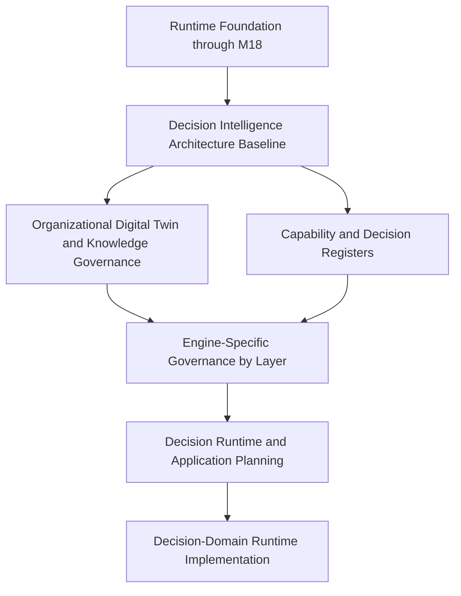

# AXI Decision Intelligence Roadmap

**Version:** 1.0.0
**Status:** Approved
**Authority:** AXI Platform Governance
**Audit Date:** 2026-07-19

---

# Purpose

Publish the post-`M18` architectural sequence that evolves AXI from a
governed runtime foundation into a governed Decision Intelligence
Platform.

This roadmap complements `Governance/RuntimeRoadmap.md`.

`Governance/RuntimeRoadmap.md` remains authoritative for runtime
dependencies through `M18`.

---

# Current State

- The governed runtime foundation is implemented through
  `M18 Runtime API`.
- The runtime foundation provides the reusable execution substrate for
  future decision-intelligence work.
- `ADR-0014` now publishes the decision-centric architecture baseline.
- `AXI-SCH-006`, `DECISION_REGISTER`, and `CAPABILITY_REGISTER` now
  publish the core decision-domain governance baseline.
- No decision-domain runtime implementation is claimed by this roadmap.

---

# Roadmap Phases

| Order | Phase | State | Entry Gate | Exit Gate |
| --- | --- | --- | --- | --- |
| 1 | Runtime Foundation through `M18` | Complete | Published runtime governance and dependencies | `Governance/RuntimeRoadmap.md` and `Governance/DependencyMatrix.md` remain consistent with repository evidence |
| 2 | Decision Intelligence Architecture Baseline | Complete | Runtime foundation through `M18` plus published decision-centric ADR | Canonical lifecycle, object topology, capability map, and decision schema are published |
| 3 | Organizational Digital Twin and Knowledge Governance | Planned | Phase 2 complete | Published schemas, registers, and governance for organization, person, role, knowledge, expertise, resources, timelines, and dependencies |
| 4 | Engine-Specific Governance by Layer | Planned | Phase 3 complete | Engine-specific ADRs, contracts, and work items are published only for implementation-ready engine domains |
| 5 | Decision Runtime and Application Planning | Planned | Phase 4 complete | Published work items define how decision-domain runtimes or applications reuse the existing AXI runtime foundation |
| 6 | Decision-Domain Runtime Implementation | Blocked pending governance | Phase 5 complete | Repository evidence demonstrates implemented decision-domain runtime or application milestones |

---

# Architectural Dependency Graph

---

# Sequencing Policy

1. Do not implement decision-domain runtime code before the decision
   architecture baseline is published.
2. Do not implement decision-domain engines before their layer-specific
   governance exists.
3. Do not collapse knowledge domains into one combined store.
4. Do not treat the Organizational Digital Twin as a secondary feature.
5. Do not bypass `Human Approval` for governed decisions unless a later
   approved ADR defines a narrower exception.
6. Reuse the existing runtime foundation through `M18`; do not create a
   competing execution substrate for decision-domain work.

---

# Next Governance Priorities

The next repository-advancement priorities after this roadmap are:

1. Publish Organizational Digital Twin schemas and registers.
2. Publish knowledge-domain schemas and governance boundaries.
3. Publish engine-specific ADRs for the first implementation-ready
   engine domains.
4. Publish work items for decision-domain runtime reuse only after the
   upstream governance exists.

---

# Related

- `Governance/ADR/ADR-0014_Decision_Intelligence_Architecture.md`
- `Governance/RuntimeRoadmap.md`
- `Governance/DependencyMatrix.md`
- `Governance/Capabilities/CAPABILITY_REGISTER.md`
- `Governance/Decisions/DECISION_REGISTER.md`
