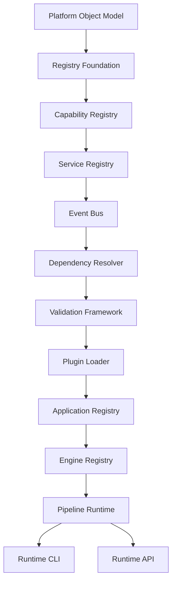

# AXI Runtime Roadmap

**Version:** 1.6.0
**Status:** Approved
**Authority:** AXI Platform Governance
**Audit Date:** 2026-07-19

---

# Purpose

This roadmap converts the runtime work queue into a dependency-driven
execution order based on repository evidence.

The roadmap exists to prevent implementation from starting when a
required upstream module is only a placeholder.

---

# Current State

- `PlatformObject` is implemented.
- Registry foundation behavior is implemented through `BaseRegistry`
  and `ObjectRegistry`.
- Capability registry is implemented and tested.
- Service registry is implemented and tested.
- Event bus is implemented and tested.
- Dependency resolver is implemented and tested.
- Validation framework is implemented and tested.
- Plugin loader is implemented and tested.
- Application registry is implemented and tested.
- `M15 Engine Registry` is implemented and tested.
- Pipeline runtime is implemented and tested.
- Runtime CLI is implemented and tested.
- Runtime API is implemented and tested.
- Runtime Foundation is complete through `M18`.
- `M21` now publishes presentation-services governance, but it does not
  authorize GUI runtime implementation.
- No runtime implementation is claimed beyond `M18`.

---

# Phase II Basis

Phase II runtime evolution is limited to repository evidence that is
already published:

- `Governance/DependencyMatrix.md` names future runtime CLI and API
  milestones as the downstream consumers of `M16`.
- `Governance/ADR/ADR-0011_Pipeline_Runtime_Boundary.md` explicitly
  excludes CLI and API execution surfaces from the `M16` boundary.
- `Governance/Schemas/AXI-SCH-007_Platform_Object.json` already
  publishes `AXI-CLI` / `CLI` and `AXI-API` / `API` object taxonomy.
- `Runtime/CLI/` is now implemented.
- `ADR-0013`, `API_CONTRACT`, and `AXI-SCH-014` are now published.
- `Runtime/API/` is now implemented.

GUI runtime is not included in Phase II because `M21` publishes
presentation governance only, and the repository still contains no
published downstream GUI runtime milestone or implementation evidence
beyond the shared object taxonomy.

---

# Dependency Graph

This graph is intentionally conservative. Later milestones may depend on
multiple earlier milestones, but no milestone may begin before every
upstream dependency in the matrix is implemented and validated.

`M17` and `M18` are parallel consumers of `M16`. The ordered plan below
reflects publication order for Phase II planning, not a published
dependency between the CLI and API milestones.

---

# Ordered Implementation Plan

| Order | Milestone | Current State | Entry Gate | Exit Gate |
| --- | --- | --- | --- | --- |
| 1 | Runtime dependency audit | Complete | Repository evidence collected | `Governance/DependencyMatrix.md` and this roadmap published |
| 2 | M9 Service Registry | Complete | Registry Foundation, Platform Object Model, and Capability Registry implemented | Runtime module, tests, and validation pass |
| 3 | M10 Event Bus | Complete | M9 complete | Runtime module, tests, and validation pass |
| 4 | M11 Dependency Resolver | Complete | M9 and M10 complete | Runtime module, tests, and validation pass |
| 5 | M12 Validation Framework | Complete | M9, M10, and M11 complete | Runtime module, tests, and validation pass |
| 6 | M13 Plugin Loader | Complete | M9 through M12 complete | Runtime module, tests, and validation pass |
| 7 | M14 Application Registry | Complete | M9 through M13 complete | Runtime module, tests, and validation pass |
| 8 | M15 Engine Registry | Complete | M9 through M14 complete and M15 governance published | Runtime module, tests, and validation pass |
| 9 | M16 Pipeline Runtime | Complete | M9 through M15 complete and M16 governance published | Runtime module, tests, and validation pass |
| 10 | M17 Runtime CLI | Complete | `M16` complete and `ADR-0012`, `CLI_CONTRACT`, and `AXI-SCH-013` published | `Runtime/CLI/` exists, validation passes, and runtime plus CLI tests pass |
| 11 | M18 Runtime API | Complete | `M16` complete and `ADR-0013`, `API_CONTRACT`, and `AXI-SCH-014` published | `Runtime/API/` exists, validation passes, and runtime plus API tests pass |

---

# Readiness Rules

1. A milestone is `Ready` only when every published prerequisite is
   backed by implemented runtime modules in this repository.
2. A placeholder directory or empty README file does not satisfy a
   runtime dependency.
3. Each milestone must compile and pass runtime tests before the next
   dependent milestone begins.
4. If numbering drift or missing prerequisite governance is discovered,
   stop implementation and update governance before resuming runtime
   development.
5. Placeholder ADR, contract, and schema files are planning artifacts
   only and do not make a milestone implementation-ready by themselves.

---

# Work Queue Maintenance Rules

Every runtime work item shall declare:

- what the milestone produces
- which published governance artifacts it depends on
- which runtime modules must already exist
- which downstream milestones consume its outputs
- what repository evidence marks the milestone as ready
- whether the milestone is an implementation-ready work item or a
  governance-planned milestone awaiting publication of placeholder
  artifacts

Use `Governance/DependencyMatrix.md` as the authoritative readiness
check for the current runtime foundation sequence.

---

# Numbering Drift

This roadmap does not renumber existing work queue files.

Current repository evidence shows:

- `ADR-0006` references `M6 Platform Object Model`
- `ADR-0006` references `M7 Capability Registry`
- the active work queue begins at `M8`
- registry foundation is implemented but not represented by an active
  work queue item

Any renumbering or backfill of historical milestones shall occur only
through a separate governance update so file history and traceability
remain intact.
